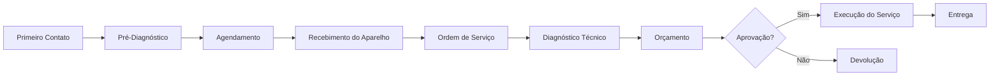
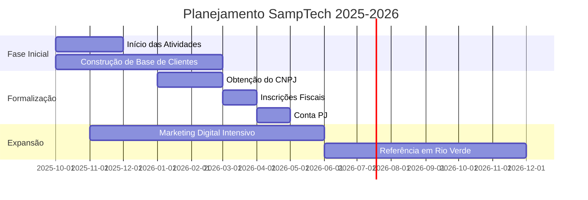

# SampTech Informática 🖥️

  
  
  
  ### 💻 Soluções Práticas e Acessíveis em Assistência Técnica
  
  
  
  
  [%209%209280--0407-25D366?style=for-the-badge&logo=whatsapp&logoColor=white)](https://wa.me/5564992800407)

---

## 📋 Sobre a SampTech

A **SampTech Informática** nasceu da vontade de ir além do simples conserto de equipamentos. Nossa missão é **desmistificar a tecnologia**, oferecendo um atendimento transparente, didático e acessível para que nossos clientes se sintam seguros e bem-informados.

Somos uma iniciativa dedicada a oferecer soluções práticas para os problemas tecnológicos do dia a dia, abrangendo desde manutenção completa de computadores e notebooks até reparos de dispositivos móveis.

  
  
  

---

## 🎯 Nossa Missão, Visão e Valores

### 🚀 Missão
> Resolver os problemas tecnológicos de nossos clientes com **agilidade**, **transparência** e **qualidade**, tornando a tecnologia uma aliada e não uma fonte de estresse, garantindo a plena funcionalidade de seus equipamentos.

### 🔭 Visão
> Ser a **principal referência** em assistência técnica em Rio Verde, reconhecida pela confiança, pelo atendimento amigável e pela excelência nos serviços prestados.

### 💎 Valores

| Valor | Descrição |
|-------|-----------|
| **🔍 Transparência** | Diagnóstico honesto e comunicação clara sobre todos os processos e custos |
| **⭐ Qualidade** | Compromisso com a execução de um serviço bem feito e duradouro |
| **⚡ Agilidade** | Trabalho eficiente para devolver o equipamento no menor prazo possível |
| **❤️ Foco no Cliente** | Ir além do conserto, ouvindo e entendendo cada necessidade |
| **📚 Paixão por Aprender** | Evolução constante acompanhando as novas tecnologias |

---

## 🛠️ Portfólio de Serviços

  
  
  

### 💻 Manutenção de Computadores e Notebooks

- ✅ **Diagnóstico Completo** - Análise profunda de hardware e software
- 🔄 **Formatação e Reinstalação** - Sistema operacional limpo (Windows/Linux)
- 🧹 **Otimização e Limpeza** - Remoção de vírus, malwares e otimização de desempenho
- 🌡️ **Manutenção Preventiva** - Limpeza física interna e troca de pasta térmica

### 🔧 Reparos e Upgrades de Hardware

- 🖥️ **Conserto e Troca de Peças** - Telas, teclados, baterias, conectores
- 📈 **Upgrade de Performance** - SSD, memória RAM, placas de vídeo
- 🎮 **Montagem Personalizada** - PCs customizados para gaming, trabalho ou estudos

---

## 🎯 Diferenciais Competitivos

<b>🌐 Presença Digital Profissional</b>

 
Site personalizado e perfil no Instagram com design de qualidade, transmitindo confiança desde o primeiro contato.

<b>📱 Marketing de Conteúdo</b>

 
Produção de vídeos curtos com dicas de manutenção, explicação de problemas comuns e tutoriais, criando uma comunidade engajada.

<b>🤝 Atendimento Personalizado</b>

 
Cada cliente recebe orçamentos detalhados e explicações claras sobre o serviço realizado.

<b>⚡ Agilidade e Custo-Benefício</b>

 
Prazos curtos de entrega e preços justos, oferecendo uma solução vantajosa.

---

## 👥 Público-Alvo

### 🚨 O Utilizador com Problemas Urgentes
Pessoas e famílias que enfrentam falhas críticas e necessitam de soluções rápidas para retomar suas atividades (trabalho, estudo, lazer).

### 📊 O Consumidor que Procura Melhorias
Clientes que desejam otimizar o desempenho dos equipamentos através de manutenção preventiva, limpeza e upgrades.

---

## 📊 Informações da Empresa

| Informação | Detalhes |
|------------|----------|
| **Nome Fantasia** | SampTech Informática |
| **Fundadores** | Gabriel Felipe Sabino de Souza, João Victor Sampaio, Fábio Filho |
| **Natureza Jurídica** | Sociedade Limitada (LTDA) |
| **Início das Atividades** | Outubro de 2025 |
| **Localização** | Rua 9 Quadra 2 Lote 19, Conjunto Morada do Sol, Rio Verde - GO |

  
  
  

---

## 📞 Canais de Contato

[%209%209280--0407-25D366?style=for-the-badge&logo=whatsapp&logoColor=white)](https://wa.me/5564992800407)

---

## 💰 Política de Precificação

Nossa política é baseada na **total transparência**:

- 📋 **Serviços de Software**: Tabela de preços fixos para serviços com esforço previsível
- 🔧 **Reparos e Upgrades**: Custo da peça + valor fixo de mão de obra
- ✅ **Aprovação Prévia**: Orçamento completo apresentado antes de qualquer serviço

> **Sem surpresas na cobrança!** O cliente sempre sabe exatamente quanto vai pagar.

---

## 📝 Processo de Atendimento

### 📋 Ordem de Serviço (OS)

Cada atendimento gera uma **Ordem de Serviço** completa com:

- 🔢 Número único de identificação
- 👤 Dados completos do cliente
- 🖥️ Especificações do equipamento
- 📸 Estado físico e acessórios
- 🔍 Diagnóstico técnico detalhado
- 💵 Valores e aprovação formal

---

## 🛡️ Política de Garantia

  
  
  

A SampTech oferece garantia para todos os serviços realizados, assegurando:

- ✅ Qualidade nos reparos
- ✅ Peças originais ou de qualidade comprovada
- ✅ Suporte pós-entrega
- ✅ Documentação completa (OS assinada)

---

## 📈 Roadmap

---

## 💼 Gestão Financeira

### Fase Atual (Informal)
- 📊 Controle via Google Sheets
- 📅 Atualização semanal do fluxo de caixa
- 💡 Foco em reinvestimento e crescimento

### Fase Futura (Formalizada)
- 🏦 Conta PJ dedicada
- 📈 Relatórios mensais para sócios
- 💼 Gestão financeira robusta

---

## 🎓 Equipe Fundadora

| Fundador | Área de Atuação |
|----------|----------------|
| **Gabriel Felipe Sabino de Souza** | Dev Full-Stack |
| **João Victor Sampaio** | Marketing e Técnico |
| **Fábio Filho** | Suporte e Atendimento |

  

---

## 🌟 Por Que Escolher a SampTech?

| Motivo | Benefício |
|--------|-----------|
| 💯 Transparência Total | Você sempre sabe o que está sendo feito |
| ⚡ Atendimento Ágil | Seu equipamento volta rápido |
| 💰 Preços Justos | Custo-benefício imbatível |
| 🎓 Equipe Qualificada | Técnicos em constante atualização |
| 🤝 Atendimento Humanizado | Você não é só mais um número |

---

## 📜 Licença

Este documento e marca são de propriedade da SampTech Informática © 2025

---

### 🚀 SampTech Informática - Tecnologia Acessível para Todos

